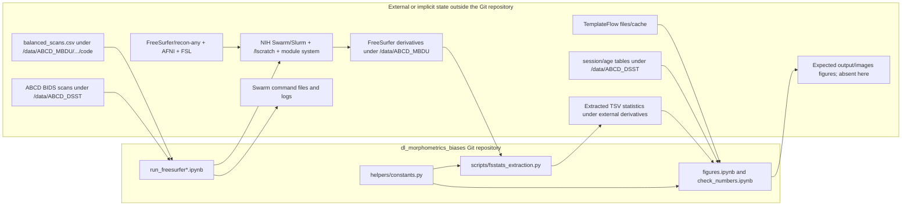

# STAMPED synthesis and review of DL Morphometric Biases

**Assessment date:** 2026-07-13  
**Project assessed:** `dl_morphometrics_biases/`, checked-out `main` at commit `448bf1a`  
**Assessment type:** document and code review; no scientific computation was executed

## Executive conclusion

The repository is a useful, Git-tracked **code module**, but it is not yet a complete STAMPED research object. Its strongest properties are basic Tracking and directory-level Modularity: source files have version history, code is separated into notebooks, scripts, and helpers, and part of the Python environment is declared. Its main weakness is that the repository boundary does not match the actual analysis boundary. Essential data, scan-selection metadata, software environments, generated commands and logs, derived FreeSurfer outputs, statistics tables, and figures live at institution-specific paths outside the repository or are absent.

This boundary mismatch propagates through the other principles. The missing components are not content-identified or linked to persistent references (T), the workflow cannot be executed from the repository (A), host and HPC state are assumed (P), fresh reconstruction is not tested (E), and a third party cannot obtain the analysis in its intended state (D). Several notebooks also contain direct top-to-bottom execution blockers, so Actionability would remain a failure even if the external data mounts were available.

### Overall assessment

| Principle | Rating | Short conclusion |
|---|---|---|
| S - Self-containment | **Fail** | The code is gathered under one root, but essential inputs, environments, outputs, logs, and retrieval references are outside it. No component licenses are included. |
| T - Tracking | **Partial** | Git tracks code and documentation, but not data, environments, execution provenance, or results; exact dependency states are not locked. |
| A - Actionability | **Fail** | The README gives setup hints and a rough sequence, but there is no executable end-to-end workflow and multiple notebooks cannot run from a fresh kernel. |
| M - Modularity | **Partial** | The folder layout and helper package separate some concerns, but data/environment/result modules are absent and logic is duplicated between notebooks and scripts. |
| P - Portability | **Fail** | Hardcoded `/data`, `/vf`, `/home`, and `/lscratch` paths and undocumented NIH HPC commands dominate execution; the full environment is not specified. |
| E - Ephemerality | **Partial, unverified** | Job-specific `/lscratch/$SLURM_JOBID` use is a good ephemeral pattern, but no fresh-clone or disposable-environment reproduction is defined or tested. |
| D - Distributability | **Fail** | The source repository is publicly retrievable, but essential data, environments, outputs, licenses, and archival identifiers are not. |

No overall principle is presently demonstrated strongly enough to rate as a full pass. This is not a judgment on the scientific idea or prior results; it is an assessment of what the checked-out research object itself makes retrievable, inspectable, and re-executable.

## 1. How the source materials were synthesized

### 1.1 Authority and source reconciliation

The May 2026 STAMPED paper is treated as the normative source. It defines the research object as the data, code, metadata, and computational environments that jointly represent a piece of research, and treats each principle as a spectrum rather than a binary certification. The paper's RFC 2119 terms are retained here:

- **MUST** is the practical minimum.
- **SHOULD** is a stronger, recommended practice.
- **MAY** is an aspirational option.

The examples site and the agent prompts are used to turn those requirements into observable project practices. They are not treated as competing specifications. This matters because the supporting materials are intentionally living documents: several examples are labeled `wip` or `uncurated-ai`, many have `verified: false`, and the draft audit omits some license requirements present in the paper. The verified stellar-distance walkthrough receives the most weight as an implementation example.

The paper and checklist materials also show minor numbering drift around programmatic provenance (for example, the prose uses T.4 while a checklist screenshot groups a component-version requirement under another number). This report follows the **requirement text**, not a potentially drifting ordinal: code-driven provenance should be captured programmatically and must identify the versions of all components involved.

### 1.2 Synthesized meaning of the seven principles

| Principle | Normative core from the paper | What convincing project evidence looks like |
|---|---|---|
| **S - Self-containment** | S.1: every essential module is reachable from one top-level research object. S.2: license declarations travel with governed components. | One clone/install entry point; included files or explicit, tracked references for data, software, and environments; no implicit host state; licenses inside the boundary. |
| **T - Tracking** | T.1: persistent content identity for every component. T.2: preferably one content-addressed system. T.3: provenance of modifications. T.4: programmatic provenance for code-driven changes, including component versions. | Git for text; git-annex/DataLad/DVC/LFS for large files; input and output hashes; exact environment identity; machine-readable commands linked to the results they produced. |
| **A - Actionability** | A.1: sufficient instructions to reproduce all computational results. A.2: procedures should be executable specifications. | A documented entry point at minimum; ideally `make`, Snakemake, Nextflow, CWL, or re-executable run records that retrieve inputs, construct environments, run steps, and verify outputs. |
| **M - Modularity** | M.1: modular organization. M.2: components may be direct or linked subdatasets. M.3: independent module licenses and compatibility checks. | Distinct raw inputs, code, environment, workflow, derived results, and documentation; independently versioned data/container modules where useful; explicit composition. |
| **P - Portability** | P.1: no undocumented host state. P.2: environments explicitly specified. P.3: definitions version controlled. | Relative/logical paths; declared host constraints; tracked lock files or container definitions; pinned system and language dependencies; configurable resources rather than user-specific paths. |
| **E - Ephemerality** | E.1: results should be produced in throwaway environments. | A clean clone or disposable job/container builds the environment and regenerates results without prior kernel, cache, or machine state; CI or scheduled tests repeat this. |
| **D - Distributability** | D.1: all components persistently retrievable. D.2: reproducible environment builds. D.3: explicit, resolvable licenses. | Public or appropriately access-controlled persistent locations, immutable versions/digests, retrieval instructions, archived releases/DOIs, and clear legal permission to reuse each module. |

### 1.3 Important distinctions learned from the examples

1. **A single directory is a boundary, not yet self-containment.** External bytes may remain remote, restricted, or too large to copy, but the research object must contain precise retrieval references, version identities, and access instructions.
2. **Git history is not computational provenance.** A commit can show that a file changed without recording the command, inputs, outputs, parameters, or environment that produced it. The `datalad run` and `datalad rerun` examples make this distinction concrete.
3. **Documentation is the minimum form of Actionability.** A README can satisfy A.1 if it is complete. A Makefile or workflow definition advances A.2 because it is executable and testable.
4. **A dependency declaration is not an exact environment.** `package>=1.0` documents intent; a lock file with hashes or a container digest identifies the state that was used.
5. **Folders are the first level of Modularity.** Independently versioned datasets, containers, or subdatasets are a stronger level when components have different lifecycles or reuse constraints.
6. **Ephemerality is an integration test for the other principles.** A fresh temporary run exposes missing inputs, unrecorded setup, host dependencies, stale notebook state, and incorrect instructions.
7. **A public Git repository is hosting, not a complete distribution.** Distribution also requires every referenced component, immutable identities, licensing, and preferably archival persistence.
8. **Improvement is incremental.** The examples progress from one script, to Git plus a Makefile, to pinned environments, clean-room tests, modular data, and archival release. No wholesale tool migration is required to begin.

## 2. What the current project actually is

### 2.1 Research-object diagnosis

| Fact to establish | Observed state |
|---|---|
| **Unit** | The checked-out repository is best described as a code module for a larger analysis rooted historically at `/data/ABCD_MBDU/ohbm2024/`. The README presents it as the analysis repository, so this review assesses whether it can serve as the top-level research object. If it is intentionally only a software module, the full research object's compliance remains unknown because that parent object is not referenced. |
| **Boundary** | Git root: `dl_morphometrics_biases/`. Operational boundary: at least two `/data/...` trees, `/vf/...`, `/lscratch`, an NIH module system, a user TemplateFlow cache, and external output/log directories. |
| **Code versioning** | Git, clean working tree, default branch `main` at `448bf1a`; a public remote is reachable at [NIMH-MLT/dl_morphometrics_biases](https://github.com/NIMH-MLT/dl_morphometrics_biases). Later work exists on remote non-default branches, so the result-producing branch/commit is not identified. |
| **Data versioning** | No data files, data manifest, submodule/subdataset, git-annex/DVC/LFS metadata, release identifier, or checksums are present. |
| **Environment** | `.python-version` specifies Python 3.9; `pyproject.toml` gives broad lower bounds; `fsstats_extraction.py` has inline `uv` dependencies. `uv.lock` is absent and explicitly ignored. FreeSurfer, recon-any, AFNI, FSL, Freeview, Swarm/Slurm, system tools, and container/module provenance are not fully specified. |
| **Execution** | Manual, stateful Jupyter notebooks generate and submit Swarm commands; a script extracts FreeSurfer statistics; notebooks perform modeling and figure generation. There is no Makefile, workflow definition, parameter file, or single entry point. |
| **Provenance** | Git records code edits. No machine-readable run records link inputs, commands, environment versions, outputs, job logs, and the Git commit that produced a result. |
| **Licensing** | No repository license or per-module license declarations are present. Data/software access and redistribution constraints are not documented. |

No open issue documents these gaps: the repository's [issue tracker](https://github.com/NIMH-MLT/dl_morphometrics_biases/issues) contained no issue objects when checked on 2026-07-13.

### 2.2 Reconstructed execution path and boundary crossings



The diagram is the central finding: the Git repository contains orchestration fragments and analysis logic, while most material nodes in the computation are neither inside the boundary nor represented by precise references inside it.

## 3. Evidence of adherence

The project already has foundations worth preserving:

- **Git tracking is real and clean.** All 17 source/configuration files in the current tree are tracked, the working tree was clean, and the public remote's `main` resolves to the same commit. Commit authorship and timestamps preserve ordinary change history.
- **A readable top-level orientation exists.** `README.md` describes the purpose, repository layout, Python setup, notebook launch, and a four-stage analysis outline (`README.md`, lines 1-119).
- **Some environment intent is version controlled.** Python 3.9 is in `.python-version`; Python dependency categories are declared in `pyproject.toml`; pre-commit tool repositories use fixed revisions; and `scripts/fsstats_extraction.py` uses a `uv` inline dependency block.
- **There is meaningful directory-level Modularity.** Reusable helper code, notebooks, and command-line scripts are separated. `constants.py` attempts to centralize pipeline names, comparisons, metric definitions, and path configuration instead of scattering every parameter through every notebook.
- **The extraction script is more actionable than notebook-only logic.** `scripts/fsstats_extraction.py` has a CLI, explicit pipeline-root argument, `--help`, configurable metrics/atlases, deterministic output naming, and an entry point.
- **Input completeness checks exist locally.** The extraction script requires all expected hemisphere/atlas statistics and `brainvol.stats` for a subject/session before accepting it (`fsstats_extraction.py`, lines 98-136). Run notebooks assert that selected input scan paths exist.
- **The workflow uses recognizable domain structure.** `sub-*`/`ses-*` paths and raw-versus-derivative concepts align with BIDS-style organization, even though the dataset modules are absent from this repository.
- **HPC jobs use disposable scratch space.** The run notebooks build a job-specific `SUBJECTS_DIR` under `/lscratch/$SLURM_JOBID`, execute there, copy results out, and delete scratch. This is a substantive fragment of Ephemerality.
- **Notebook-output stripping makes source diffs smaller.** All six notebooks are valid notebook JSON, and current tracked notebooks contain no output payloads. This helps code review, though it also means result evidence must be preserved elsewhere.
- **The analysis code includes assertions and statistical correction attempts.** Length/age completeness assertions and multiple-comparison procedures show attention to invariants. They are not yet part of an automated verification suite.

## 4. Detailed assessment against every normative item

### 4.1 S - Self-containment

#### S.1 - Essential components reachable from one top-level object: **Fail**

Positive evidence:

- Code, notebooks, package metadata, and configuration are under one Git root.
- The README gives the repository a stated purpose and describes its internal layout.

Contrary evidence:

- `constants.py` points to `/data/ABCD_MBDU/ohbm2024/`, two `/data/ABCD_DSST/...` tables, and an external TemplateFlow directory (`constants.py`, lines 87-96).
- `run_freesurfer.ipynb` and `run_freesurfer8-recon-all.ipynb` require an absent `balanced_scans.csv`, raw BIDS data, Swarm command/log directories, and derivatives outside the repository (both notebooks, cells 6-9).
- `comparison_script.sh` hardcodes `/data/ABCD_MBDU/ohbm2024/data/derivatives/freesurfer` (line 8).
- `check_numbers.ipynb` additionally names another user's `/home/nielsond/.cache/templateflow/...` files (cells 85 and subsequent surface cells).
- `process_freesurfer_recon-any.ipynb` refers to `/vf/users/ABCD_MBDU/...` (cell 3).
- The current tree has no `data/`, `output/`, input manifest, environment directory, job-command archive, or log archive, despite the README's claimed layout.
- No persistent dataset identifiers, immutable URLs, checksums, data release names, or access procedures make these external components reachable from the Git root.

The smallest conceptual fix is not necessarily to copy restricted ABCD data. It is to make the repository the retrieval unit by adding tracked, exact references and authorized retrieval instructions for each external component.

#### S.2 - License declarations travel with components: **Fail**

- No `LICENSE`, `LICENSES/`, `REUSE.toml`, SPDX declaration, data-use notice, or component license manifest is present.
- The legal/access relationships among the project code, ABCD data, FreeSurfer, recon-any, TemplateFlow resources, and generated derivatives are not described.

### 4.2 T - Tracking

#### T.1 - Persistent content identity for all components: **Partial**

- **Pass for current text/code:** Git content-addresses all files in the checked-out repository.
- **Fail for the research object:** input scans, scan-selection CSV, age/session tables, FreeSurfer outputs, extracted TSVs, figures, logs, containers/modules, and TemplateFlow artifacts have no recorded content identity here.
- The public Git remote improves obtainability of source code, but no release or tag identifies the state associated with any claimed result.

#### T.2 - One content-addressed system across components: **Fail**

- Git is the only content-addressed system present.
- Large/restricted data and binary environments are not represented through git-annex, DataLad, DVC, LFS, submodules, manifests, or another compatible identity layer.

#### T.3 - Provenance of modifications: **Partial**

- Git commits record ordinary edits to code and documentation.
- The computational transformations are not recorded. Generated Swarm files and logs live outside the repository; notebook submissions and job cancellations occur interactively; manual failed-subject lists are pasted into a notebook; and derived outputs are absent.
- The repository cannot answer: which input snapshot, exact command file, job array, environment build, code commit, and exception/rerun history produced a given TSV or figure?

#### T.4 - Programmatic provenance including component versions: **Fail**

- There are no `datalad run`, workflow metadata, RO-Crate, W3C PROV, BIDS-Prov, or equivalent run records.
- Notebook cells are executable text, but they are not result-linked provenance records. All six notebooks have zero saved outputs and zero execution counts: 336 code cells are present without an inspectable executed state.
- Environment identity is incomplete: dependencies have broad lower bounds, `uv.lock` is absent and ignored, and HPC modules/container identities are not captured with outputs.
- Remote branches contain later commits than default `main`; the project does not say which branch/commit generated the analysis under review.

### 4.3 A - Actionability

#### A.1 - Sufficient instructions to reproduce all computational results: **Fail**

Positive evidence:

- The README explains how to install Python dependencies, launch JupyterLab, invoke the extraction CLI, and conceptually move from processing to figures.
- The extraction script exposes a usable command-line parser.

Blocking evidence:

- The README does not identify the authoritative result set, required notebook order, exact notebook parameters, source-data release, generation of `balanced_scans.csv`, HPC prerequisites, retrieval of environments, job submission/rerun policy, or commands that reproduce final outputs.
- `figures.ipynb` imports `constants` as `cfg` but repeatedly accesses nonexistent `cfg.cfg` beginning in cell 8. `constants.py` defines module-level names and has no `cfg` object.
- `figures.ipynb` cell 67 deliberately executes `raise AssertionError()`, so a full top-to-bottom run stops even if earlier problems are corrected.
- `figures.ipynb` cell 28 creates a random train/test split with no seed. Later exploratory cells depend on mutable variables and stale names. The notebook also computes `q_all` in cell 24 but assigns the Boolean `sig_all` array to both `q` and `fdr_sig`, which needs correction or an explicit rationale.
- Figure-saving cells expect `../output/images/`, but the directory is absent and no cell creates it.
- `process_freesurfer_recon-any.ipynb` writes a second `fsstats_extraction.py` into the notebook working directory, then calls an undefined `path_inputs` in cell 8. This duplicates and can diverge from the tracked `scripts/fsstats_extraction.py`.
- `check_numbers.ipynb` is a 150-code-cell exploratory notebook with only three headings. Cell 112 begins with unexpected indentation, and numerous cells depend on mutable state and another user's TemplateFlow cache.
- `run_freesurfer.ipynb` contains hardcoded `scancel`/`sjobs` operations and notes that T2 resampling was not run before later rerun cells (cells 13, 22-24, 30, and 35-39). It is an operational lab notebook, not an unambiguous reproduction recipe.
- `run_freesurfer8-recon-all.ipynb` pastes a manually extracted failed-subject list and removes prior output directories from the interactive kernel before constructing rerun jobs (cells 19-27).

#### A.2 - Procedures as executable specifications: **Fail**

- There is no Makefile, Snakemake/Nextflow/CWL workflow, parameter schema, end-to-end script, or re-executable provenance chain.
- No `tests/` directory or CI workflow exists. Pre-commit checks source style but do not execute the scientific pipeline or notebooks.
- The notebook filter named in `.gitattributes` depends on local Git filter configuration; the checked-out clone did not have that local configuration. This is another setup step not made automatically actionable.

### 4.4 M - Modularity

#### M.1 - Modular organization: **Partial**

Positive evidence:

- `dl_morphometrics_helpers/`, `scripts/`, and `notebooks/` are separated.
- Metrics, pipeline comparisons, and some paths are centralized in `constants.py`.
- The README conceptually distinguishes generated outputs and figures.

Gaps:

- Raw inputs, immutable input metadata, environments, workflows, provenance, derived datasets, and final result artifacts are not modules within or referenced by the object.
- Orchestration, monitoring, repair, exploration, statistics, and publication-figure generation are mixed in long stateful notebooks.
- Extraction logic is duplicated between `process_freesurfer_recon-any.ipynb` and `scripts/fsstats_extraction.py`; substantial analysis logic is duplicated between `check_numbers.ipynb` and `figures.ipynb`.
- `constants.py` mixes scientific definitions with institution-specific absolute paths, coupling otherwise reusable code to one deployment.

#### M.2 - Direct or linked subdatasets: **Not adopted (MAY), functionally needed**

- There are no Git submodules, DataLad subdatasets, or other independently versioned component links.
- This optional practice is especially appropriate here because restricted raw data, FreeSurfer derivatives, environment images, and analysis code have different sizes, licenses, access rules, and update cycles.

#### M.3 - Independent module licenses and compatibility: **Fail**

- Module licenses are absent, and there is no compatibility/access note at the boundaries between code, data, and neuroimaging software.

### 4.5 P - Portability

#### P.1 - No undocumented host-state dependency: **Fail**

The project assumes all of the following without a complete, portable adapter or specification:

- `/data/ABCD_MBDU`, `/data/ABCD_DSST`, `/vf/users`, `/lscratch`, and `/home/nielsond` layouts;
- NIH `swarm`, `sjobs`, `scancel`, Slurm variables, partitions, `--gres=lscratch`, and environment-module syntax;
- the `ABCD_MBDU` Unix group plus permission-changing rights;
- `FREESURFER_HOME`, `SetUpFreeSurfer.sh`, `run_recon-any`, `recon-all`, `freeview`, AFNI `3dresample`, FSL, `rsync`, `tree`, and shell utilities;
- a pre-populated TemplateFlow filesystem;
- notebook working-directory conventions and accumulated kernel variables.

The use of `pathlib.Path` is good implementation practice, but wrapping an absolute institutional root in `Path` does not make it portable.

#### P.2 - Explicit computational environments: **Partial**

- Python 3.9 and broad Python packages are declared.
- The extraction script separately declares `freesurfer-stats>=1.2.0` and `pandas>=1.0.0,<2.0.0` inline.
- The run notebooks name `freesurfer/8.0.0-beta` and `freesurfer/8.0.0` module strings, but the full environment, original recon-all baseline, recon-any implementation, AFNI/FSL versions, system libraries, and container/module sources are not specified.
- Directly used functionality is not fully represented as direct locked dependencies (for example SciPy imports and Feather-writing support).

#### P.3 - Version-controlled environment definitions: **Partial**

- `.python-version`, `pyproject.toml`, inline script metadata, and pre-commit revisions are tracked.
- `uv.lock` and `pixi.lock` are explicitly ignored; no requirements lock with hashes, container recipe, image digest, Apptainer definition, Nix/Guix definition, or module collection is tracked.
- The definitions that are tracked are therefore insufficient to reconstruct the environment that generated any result.

### 4.6 E - Ephemerality

#### E.1 - Results produced in disposable environments: **Partial, runtime unverified**

Positive evidence:

- FreeSurfer jobs use per-job scratch under `/lscratch/$SLURM_JOBID` and remove that scratch after copying outputs.
- Swarm/Slurm allocations are naturally temporary execution contexts.

Limitations:

- The software module stack, shared source data, persistent output directories, TemplateFlow cache, notebook kernel, and generated command files all carry external state into the job.
- There is no script that clones the repository into a temporary directory, builds the declared environment, retrieves a test input, executes the workflow, and verifies outputs.
- No CI or scheduled HPC smoke test regularly demonstrates fresh reconstruction.
- The notebooks' undefined variables, stale state, and deliberate stop are direct evidence that fresh-kernel execution is not currently maintained.

The project demonstrates *ephemeral compute allocation*, but not yet *ephemeral reconstruction of the research object*.

### 4.7 D - Distributability

#### D.1 - Every component persistently retrievable: **Fail**

- The Git source is publicly accessible as of the assessment date.
- Essential data and metadata are only named by filesystem paths. Environment images/modules, logs, extracted statistics, and final figures are not distributed or referenced persistently.
- There are no tagged releases, archived snapshots, DOIs, checksummed manifests, container digests, or documented authenticated retrieval procedures.

Restricted data can still satisfy D.1 when access conditions and persistent retrieval mechanisms are explicit. The current repository does not provide those instructions or identifiers.

#### D.2 - Reproducible environment builds and regular retesting: **Fail**

- No exact environment build is available, and no clean-room test reconstructs one.
- No environment artifact is archived with or persistently referenced by the research object.

#### D.3 - Explicit resolvable licenses: **Fail**

- Project and component licenses are absent. This prevents a recipient from knowing what may lawfully be copied, modified, archived, or redistributed.

## 5. Cross-cutting risks revealed by the audit

### 5.1 The result lineage is currently unrecoverable from the repository

The repository contains neither result artifacts nor provenance that names the exact result-producing commit, branch, input versions, environment, commands, and job outcomes. Later remote branches contain substantial changes not merged into `main`. Before refactoring, the project should identify and preserve the actual lineage of any poster, abstract, manuscript, or figure being treated as the baseline.

### 5.2 Notebook state is doing too many jobs

The notebooks currently act as scheduler, command generator, monitor, incident log, data processor, statistical analysis, scratchpad, and figure builder. Those are legitimate activities, but placing them in one mutable kernel makes execution order and authority ambiguous. The report notebook should consume declared, immutable inputs; job submission and recovery should live in parameterized workflow code; exploratory cells should be clearly excluded from reproduction.

### 5.3 Environment ambiguity affects scientific interpretation, not only installation

This study compares morphometric pipelines, so exact FreeSurfer/recon-any/AFNI versions and flags are part of the scientific method. An imprecise environment can change the quantity being compared. Capturing those versions is therefore a T and P requirement with direct methodological significance.

### 5.4 Restricted data changes the implementation, not the principles

ABCD inputs may not be redistributable. STAMPED does not require violating data-use terms. A compliant object can distribute machine-actionable access instructions, exact release/query identifiers, checksummed file manifests where permitted, and a synthetic or authorized smoke-test dataset while keeping protected bytes in approved storage.

## 6. Prioritized conversion plan

These are recommendations for the next phase; they have not been implemented in this review.

| Priority | Smallest high-leverage change | Principles advanced |
|---|---|---|
| **0 - Preserve the baseline** | Identify the exact branch/commit and result set used for the existing analysis. Save the generated Swarm command files, relevant logs, manual rerun decisions, software/module versions, input manifests, and output checksums before refactoring. | T, A, D |
| **1 - Define the boundary** | Declare this repository as the top-level research object or link it from the true parent. Add `inputs/`, `envs/`, `workflow/`, `outputs/`, and `provenance/` roles plus a tracked project configuration using logical paths. Represent restricted data with exact release/access metadata and manifests. | S, M, P, D |
| **2 - Create one executable workflow** | Move authoritative processing and analysis from notebooks into parameterized scripts and a Makefile or Snakemake workflow. Declare inputs/outputs for scan selection, each reconstruction variant, extraction, modeling, and figures. Keep notebooks as review/report interfaces. | A, T, M, E |
| **3 - Freeze the environments** | Track `uv.lock` (or a hash-locked equivalent) for Python. Define and pin the FreeSurfer/recon-any/AFNI/FSL execution environment by immutable container digest or an equally exact module/build specification. Record license-gated retrieval where images cannot be bundled. | T, P, S, D |
| **4 - Capture run provenance** | At minimum, write a machine-readable run manifest containing Git commit, input identities, parameters, command, environment digest, scheduler job IDs, exit status, and output hashes. For this neuroimaging/large-data setting, DataLad + git-annex and `datalad containers-run` are a strong fit, but a well-instrumented Snakemake/Make stack can also satisfy the properties. | T, A, D |
| **5 - Test ephemerally** | Add unit tests for helpers/extraction using synthetic FreeSurfer stats, a one-subject smoke test, and a clean-clone reproduction script. Run lightweight tests in CI and a periodic full/HPC smoke test where licensed tools and data are available. | A, P, E, D |
| **6 - Make a lawful distribution** | Add a code license, data-use/access documentation, citations, authorship metadata, tagged releases, and an archival deposit/DOI. Publish or persistently reference environment artifacts and permitted derived results. | S, M, D, T |

### 6.1 Suggested minimal target layout

```text
dl_morphometrics_biases/
├── README.md
├── LICENSE
├── pyproject.toml
├── uv.lock
├── config/
│   ├── analysis.yaml
│   └── profiles/nih-biowulf.yaml
├── inputs/
│   ├── README.md
│   ├── abcd-release.json
│   ├── scan-manifest.tsv
│   └── templateflow-manifest.tsv
├── envs/
│   ├── analysis.lock-or-container-definition
│   └── neuroimaging-images.json
├── workflow/
│   ├── Snakefile-or-Makefile
│   └── scripts/
├── src/dl_morphometrics_helpers/
├── notebooks/
│   ├── exploration/
│   └── report.ipynb
├── tests/
│   ├── fixtures/
│   └── test_smoke.py
├── outputs/
│   └── README.md
└── provenance/
    └── README.md
```

This is illustrative, not a mandate. The important properties are an explicit boundary, logical/configurable paths, distinct roles, an executable workflow, exact environment identity, and result-linked provenance.

### 6.2 Minimum definition of done for the converted analysis

The conversion can be considered a credible STAMPED baseline when:

1. A fresh clone identifies every component needed for the intended result, including how authorized users obtain restricted inputs.
2. A tracked command builds or retrieves the exact computational environments.
3. One documented command executes a smoke-scale workflow without notebook edits or prior kernel state.
4. The full workflow has explicit inputs, outputs, parameters, and failure/rerun behavior.
5. Every preserved result is linked to code commit, input identities, environment identity, command, and output checksums.
6. A clean disposable run is tested regularly.
7. Project and component licenses/access terms are explicit.
8. A tagged, archived release makes the intended state persistently retrievable.

## 7. Unknowns to resolve before implementation

The following cannot be established from the checked-out repository and materially affect the conversion design:

- Which figures/tables/statistics constitute the authoritative result set?
- Which Git branch and commit generated those results?
- How was `balanced_scans.csv` produced, and what exact ABCD release/query does it select?
- Which recon-all version generated the baseline `recon-all` derivatives?
- What exact distribution/build provides `run_recon-any` and `recon-all-clinical`?
- Are existing Swarm command files, logs, failed-subject decisions, extracted TSVs, and final figures still available?
- What are the access and redistribution rules for raw inputs and derived morphometrics?
- Is the desired target limited to NIH Biowulf, or must the analysis also run on another HPC/local host?
- Should full raw/derivative data be managed as DataLad/git-annex modules, or should the repository carry only manifests and access-controlled retrieval adapters?

These unknowns should be answered by inspecting the original analysis storage before reorganizing or deleting anything.

## 8. Validation performed for this review

Completed:

- Rendered and visually inspected all 24 pages of the STAMPED PDF; extracted its text for requirement-level review.
- Read the principle pages, all example metadata and structures, the verified stellar-distance walkthrough, the progressive AWK walkthrough, and the provenance, rerun, modularity, container, and ephemeral examples.
- Read both STAMPED agent/prompt drafts and the repository assessment prompt.
- Inspected every tracked project file, all six notebooks, Git history/branches/remotes, ignore rules, and package/configuration files.
- Confirmed all notebook JSON is structurally valid.
- Confirmed the current Git tree is clean and public `main` resolves to the checked-out commit without credentials.
- Confirmed the absence of data, outputs, tests, CI, lock files, and a license in the current tree.
- Checked the public issue tracker before recommending fixes; no issue object documented these gaps.

Not performed:

- No FreeSurfer/recon-any/AFNI/FSL computation or notebook execution.
- No restricted ABCD data access.
- No NIH Swarm/Slurm submission.
- No scientific validation of model choices or numerical findings beyond identifying obvious execution and verification risks.

Consequently, this report can establish failures that are visible in the object and partial strengths visible by design. It cannot establish that historical computations failed, nor can it turn undocumented external success into a current STAMPED pass.

## 9. Materials reviewed

- `Macdonald et al. - STAMPED principles for reproducible research objects.pdf` (May 2026, 24 pages)
- `stamped-examples/content/stamped_principles/*/_index.md`
- `stamped-examples/content/examples/*.md`
- `stamped-examples/.claude/commands/stamped-assess.md`
- `stamped-agents/stamped-skill-draft.md`
- `stamped-agents/stamped-skill-next-steps.md`
- `dl_morphometrics_biases/README.md`, environment/configuration files, helper package, scripts, Git history, and all six notebooks
